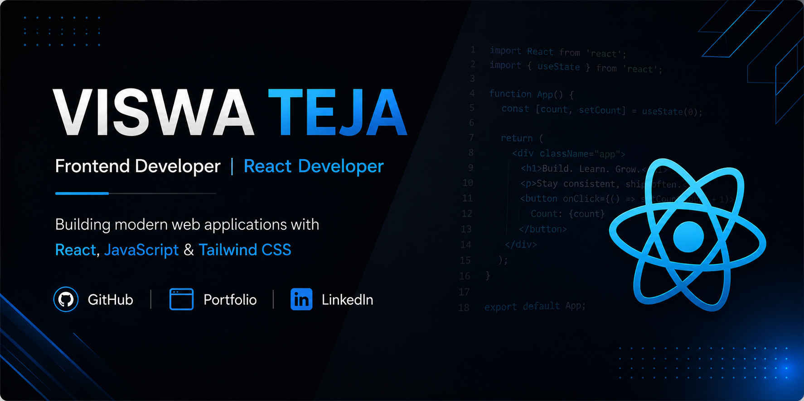

  

# Hi 👋, I'm Viswa Teja

### Frontend Developer | React Developer

## 🚀 About Me

Frontend Developer passionate about building responsive and user-friendly web applications.

- 💻 Focused on React Development
- 🌱 Continuously improving JavaScript and Frontend Architecture skills
- 🚀 Building real-world projects
- 📚 Learning through projects and hands-on development

## 🛠 Tech Stack

## 📊 GitHub Stats

  

## 💻 Most Used Languages

  

